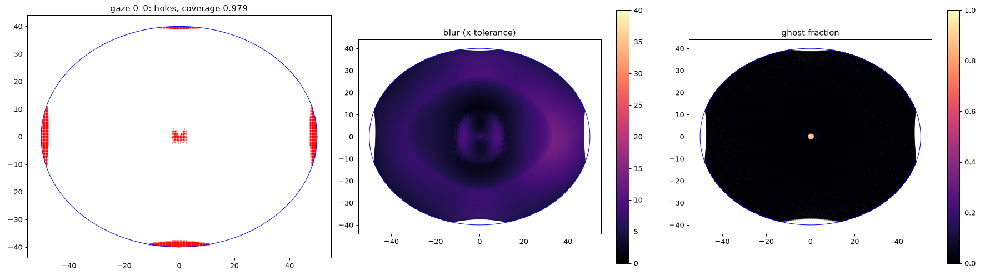
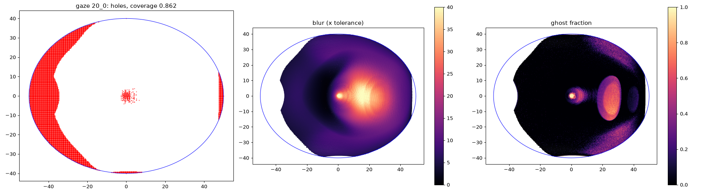

# The 100 x 80 ellipse pancake with a turning eye — 2026-09-27

## Question

When the eye looks away from straight ahead, its pupil turns about the eye's
centre of rotation (13.5 mm behind the cornea, 9.9 mm behind the pupil). The
pupil then moves sideways and tilts. The stored designs assume a fixed pupil
on the axis. How much does the stored 100 x 80 ellipse design
(`results_pancake/best_pancake_el2_glass_ell100x80.json`, rank 0) degrade when
the optics stay fixed and only the pupil moves with the gaze?

## Method

`lf_evaluate.py --gaze-deg TX TZ` turns the evaluator's 61 pupil points about
the centre of rotation so that the eye's axis points along the gaze
(`lf_evaluate.gaze_views_mm`, Listing's minimal rotation). The cameras keep
their straight-ahead orientation (each pupil point is a pinhole that sees
every direction), so all metrics are computed as before, against the
straight-ahead retina. At gaze (0, 0) the renders are bitwise the same as the
stored evaluation.

These numbers therefore measure the **eyebox** only: what the moved pupil
sees. They do not yet judge the new fovea's resolution. The static map
samples the gaze direction 8-19x more coarsely than the fovea needs at
10-30 deg gaze (`docs/research_eye_tracked_foveal_lightfield_2026-09-27.md`),
and that loss comes on top.

## Results (Cycles, 2560 px panel)

| Gaze | Pupil shift | Coverage | Blur median / p90 (x tolerance) | Ghost | Stray | Throughput | Fill p10 |
|---|---|---|---|---|---|---|---|
| 0 | 0 | 0.979 | 5.58 / 8.88 | 0.006 | 0.48 % | 0.900 | 1.00 |
| 10 deg right | 1.7 mm | 0.925 | 6.62 / 13.67 | 0.012 | 0.41 % | 0.864 | 1.00 |
| 20 deg right | 3.4 mm | 0.862 | 7.69 / 27.43 | 0.074 | 0.59 % | 0.790 | 0.98 |
| 30 deg right | 5.0 mm | 0.798 | 9.42 / 40.04 | 0.208 | 1.87 % | 0.714 | 0.84 |
| 20 deg down | 3.4 mm | 0.900 | 7.24 / 17.03 | 0.013 | 0.25 % | 0.851 | 1.00 |

Straight ahead:

20 deg to the right:

At 20 deg to the right:

- The field beyond about -35 deg on the far side is lost: the moved pupil
  no longer sees it (eyebox vignetting).
- The worst blur (30-40x tolerance) sits at +10 to +25 deg, **where the eye
  now looks**. Straight ahead, the same region is below 10x.
- A ghost area appears at +20 to +30 deg, also at the new gaze.

## Conclusion

From about 10-20 deg of gaze the static design fails in the direction the eye
turns to, from the pupil shift alone. A steered or a larger eyebox is needed
as well as a steered fovea. Most natural gaze shifts stay within about
15-20 deg before the head turns too (see the research note), so the eyebox
target is roughly +-20 deg of gaze, a pupil travel of +-3.4 mm.

## Next

A steered-eyebox study: model a moving element in the evaluator (for
example the pancake following the pupil) and find which motion restores the
straight-ahead numbers at 20-30 deg gaze. That motion is the actuator
specification.
