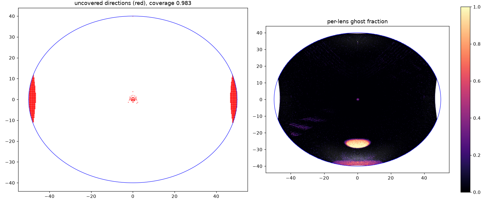
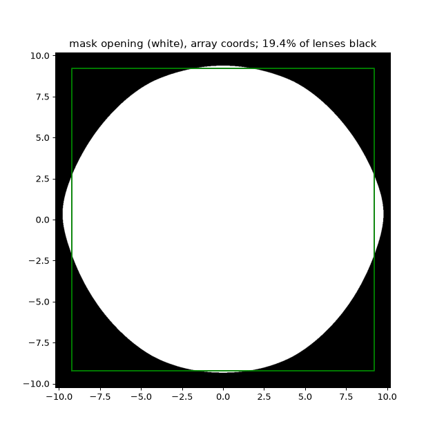

# Elliptic field with a black mask, and a faster evaluator — 2026-09-26

## Summary

- An **elliptic 100 x 80 deg field** is much better than the 100 x 80
  rectangle. The display then has a black mask over the lenslets outside
  the design's own image of the ellipse.
- The 2-lens glass pancake at the 100 x 80 ellipse is now the best wide
  design. Its coverage (0.969) is above that of the 84 x 61 rectangle.
- Wider ellipses fail: from 107.5 x 86 deg the ghosts come back (0.36).
- The Cycles evaluation is about **2.5x faster**: about 10 min became 3.9 min.
  The render and mesh changes are bit-identical. The GPU metrics agree with
  the CPU ones to 2e-14 in the report.

All numbers come from the Cycles evaluation (`lf_evaluate.py`, 2560 px panel).

## Results

| Field (deg) | Shape | Coverage | Blur median / p90 (x tolerance) | Ghost | Stray | Eye relief |
|---|---|---|---|---|---|---|
| 84 x 61 | rectangle | 0.945 | 5.4 / 9.5 | 0.001 | 0.39 % | 18.4 mm |
| 100 x 80 | rectangle | 0.890 | 7.7 / 13.5 | 0.104 | 3.2 % | 15.0 mm |
| **100 x 80** | **ellipse** | **0.969** | **6.7 / 11.8** | **0.025** | **1.3 %** | 15.2 mm |
| 107.5 x 86 | ellipse | 0.925 | 8.3 / 13.2 | 0.355 | 6.5 % | 15.3 mm |
| 112.84 x 90.27 (same area as 100 x 80) | ellipse | 0.848 | 10.9 / 16.8 | 0.373 | 11.7 % | 15.1 mm |

Result file: `remapper_designs/freeform_mirror/results_pancake/best_pancake_el2_glass_ell100x80.json`
(rank 0). Search, export and evaluation all need
`HOLOPIXEL_FIELD_DEG=100x80 HOLOPIXEL_FIELD_SHAPE=ellipse`.

The ghost figure (0.025) is below the 0.05 pass mark. Coverage (0.969 against
0.98) and blur (p90 11.8 against 0.75) still fail.

- The remaining coverage loss is at the left and right edge middles, beyond
  about +-47 deg, where the design lands its field off the panel. There are
  also thin slivers at the top and bottom.
- The remaining ghosts are the map fold at the bottom centre, with a weaker
  one at the top. The ellipse keeps those directions. The diagonal ghost
  bands of the rectangle's corners are gone.

The mask opening is a rounded square on the panel, because the retina-matched
map compresses the periphery. It covers 19 % of the lenses.

## How the mask is placed

1. **By the target map (rejected).** The mask followed the foveation target's
   image of the ellipse. The designs' maps are 3-7 % wider than the target at
   the edge, so the whole edge band fell behind the mask: coverage was 0.74.
   A panel term against that opening (weight 300) raised it only to 0.81.
2. **By the design (kept).** The mask opening is each design's own image of
   the ellipse edge: the chief-ray landings of the edge, as a closed polygon.
   - The exporter writes it (`mask.npz`, named in `design.json`).
   - The evaluator requires it for an elliptic field and refuses it for a
     rectangle.
   - The search's outside term asks that directions beyond the field land
     0.2 mm or more outside the design's own polygon.
   - The tracer estimate of the coverage (0.96) matched Cycles (0.959).

## Code changes

- `screen_spec`: `HOLOPIXEL_FIELD_SHAPE` (`rect` or `ellipse`), `in_field`,
  `field_boundary_deg`. A design records the shape in `field_deg`.
- `foveation_target`: the map stretches the field's own outline (the rectangle
  or the ellipse) over the panel.
- `fold_search`:
  - the sampled fields are clipped onto the ellipse, and its edge is sampled;
  - the fold check traces only in-field points;
  - the beyond-field rings follow the ellipse;
  - the outside term uses the design's own opening polygon (`polygon_depth`).
- `variable_lenslets`: `mask_table`, `masked`, `with_mask`.
- `export_pancake`: writes the mask. `lf_evaluate`: applies it; the in-field
  test and the coverage grid follow the ellipse.

## Evaluator speed (same results)

| Change | Before | After |
|---|---|---|
| One render tile instead of four | 4.5 s a view | 3.2 s |
| Multi-view renders, 16 pupil views per call | 3.2 s a view | ~1.5 s |
| EXR written uncompressed (read back at once) | small gain | |
| Lenslet mesh: an array rebuilt inside a loop | 76 s | 25 s |
| Metrics: one pass fewer, no `np.isin` / `np.unique` | 80 s | 53 s |
| Metrics: per-view passes on the GPU (fp64 torch) | 53 s | 16 s |
| Blender scene: lenslet mesh by `foreach_set`, not `from_pydata` | 33.6 s start-up | 25.7 s |
| View decoding in threads, while the next batch renders | 160 s for 40 views | 137 s |
| **Whole evaluation (100 x 80)** | **~10 min** | **3.9 min** |

- Each CPU change was checked bitwise: the per-view pixel and lens arrays,
  the lenslet mesh for both flips, and `report.json` end to end (5.7 min).
- The GPU metrics sum floats with atomic adds, in no fixed order (chosen for
  speed). Every count-based number is exact; the blur percentiles differ by
  up to 2e-14 relative, and per-lens blur by up to 6e-11. End to end (3.9 min)
  the report differs from the stored one in 3 blur values, by <= 1.4e-13.
- GPU + CPU rendering was slower (4.7 s a view) and not identical, so it is
  not used.
- A trap in Blender's multi-view render: a view's camera is found by swapping
  the suffix at the end of the ACTIVE camera's name. If that name has no view
  suffix, every view silently renders from the active camera.

## Next steps

1. At the 100 x 80 ellipse, remove the bottom-centre map fold (the main ghost
   area).
2. Bring the edge middles back onto the panel (the panel polish of the
   84 x 61 work), for coverage 0.98.
3. Speed-up: the renders are now most of an evaluation (~1 s a view, ~2 min).
