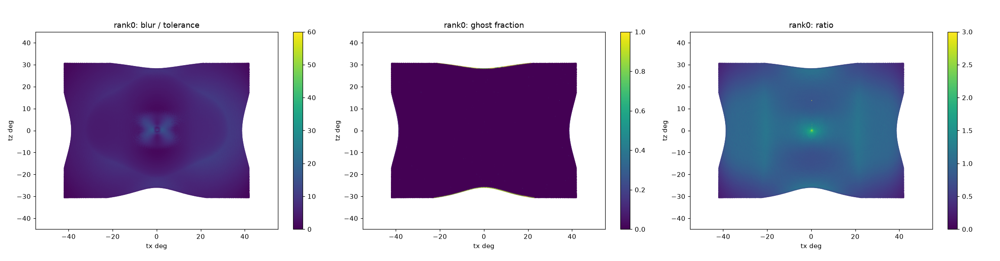
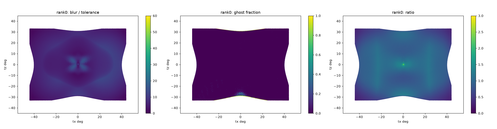
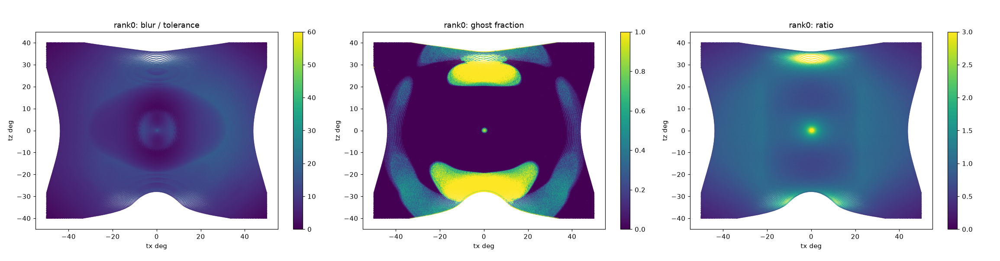

# Wider field of view for the pancake remapper — report and status, 2026-09-26

## Summary

The goal was a 100 x 80 deg glass pancake at the quality of the 70 x 45 deg
design, and then a wider field if possible.

- A 2-lens pancake reaches **88 x 66 deg** at nearly the 70 x 45 quality. It has
  fewer ghosts, and a little less coverage and sharpness.
- At **100 x 80 deg** the best design is still far from the target: coverage
  0.89 and ghosts 0.10.
- On the way, the search became about 2.4x faster, and one bug in the
  evaluator was found and fixed. That bug made every result wider than 76 deg
  look worse than it was.

All numbers come from the Cycles evaluation (`lf_evaluate.py`, 2560 px panel,
black lenslet walls). The optics are geometric: no diffraction, ideal pancake
polarisation, lossless glass.

## Results

| Field (deg) | Lenses | Coverage | Blur median / p90 (x tolerance) | Ghost | Stray | Eye relief |
|---|---|---|---|---|---|---|
| 70 x 45 (earlier best) | 1 | 0.978 | 4.6 / 7.9 | 0.012 | 0.29 % | 23 mm |
| 84 x 61 | 2 | 0.945 | 5.4 / 9.5 | 0.001 | 0.39 % | 18.4 mm |
| 88 x 66 | 2 | 0.943 | 6.3 / 11.3 | 0.002 | 0.38 % | 15.9 mm |
| 100 x 80 | 2 | 0.890 | 7.7 / 13.5 | 0.104 | 3.2 % | 15.0 mm |

The 84 x 61 field has 1.6x the area of 70 x 45, and 88 x 66 has 1.8x.

Result files (in `remapper_designs/freeform_mirror/results_pancake/`). Each
entry records its field, merit weights and tilt limit:

- `best_pancake_el2_glass_fov84x61.json` (the table row is rank 0)
- `best_pancake_el2_glass_fov88x66.json` (rank 0)
- `best_pancake_el2_glass_fov100x80.json` (rank 0). This is a starting point
  for the next search, not a finished design.

Per-lens maps (blur, ghost fraction, magnification ratio against the target):





At 84 x 61 and 88 x 66, the only loss is at the middle of each field edge:
the covered outline curves inwards there. At 100 x 80, two large ghost areas
sit at the top and bottom centre, where the map folds (the ratio is above 3,
and some lenses get no light).

## How the designs were found

1. **Field continuation.** The search starts from the 70 x 45 spline pancake
   and widens the field by 2 deg per step. Each step starts from the designs
   of the step before (`--seed-other-field`, with the designs that keep every
   ray at the new field). Random starts at 100 x 80 did not find this family
   of designs.
2. **A second lens.** It starts as a thin even shell that follows the back of
   lens 1, so it has almost no power (merit 387 -> 453 at the first step). A
   flat plate cut through the strongly curved lens back.
3. **Chief-ray tilt limit.** The settings are `--weight tilt=30
   --tilt-max-deg 20`, with `--weight map=5`. At the old tilt weight (1) the
   search ignored the tilt, which reached 50 deg at the field corners, and
   most of the stray light came with it. With the limit, the ghosts at
   84 x 61 fell from 0.065 to 0.001-0.002.
4. **Panel polish.** An 80-iteration run with `--weight panel=300` brings the
   edge-middle fields back onto the panel. Coverage went up: 0.907 -> 0.945 at
   84 x 61, and 0.919 -> 0.943 at 88 x 66.
5. **Ranking by Cycles, not by the merit.** At the same field the merit and
   Cycles disagreed several times (for example ghost 0.004 at rank 1 against
   0.125 at rank 0).

## Code changes (all committed and pushed)

- **Search speed, about 2.4x, with the same results.** Checked against saved
  baselines: residuals to 1e-13 and the Jacobian to 1e-10 relative.
  - The polynomial evaluates only its nonzero terms (Horner's rule in x^2, y).
  - Newton stops once no ray moves more than 1e-12 mm.
  - cos and sin of each tilt are computed once per design, not once per ray.
  - Jacobian columns and LM dampings are traced in one batch.
- **Evaluation camera** (`lf_evaluate.CAMERA_FOV_DEG`). It now covers the field
  plus 3 deg. Before, it stayed fixed at 76 deg, so every evaluation of a
  wider field was cut at +-38 deg. The first 100 x 80 design really had
  coverage 0.85 and ghosts 0.27, not the 0.65 and 0.039 reported.
- **Lens-domain barrier** (`pancake_search.lens_domain_violation`). Every lens
  face must keep its sag domain on the disc that the exporter builds. Before
  this term, the best 100 x 80 designs could not be exported. Rank by rank,
  the term agrees with the exporter.
- **Search settings**, recorded in every result:
  - `--weight NAME=VALUE` (repeatable) replaces `--ratio-weight`;
  - `--tilt-max-deg` sets the tilt limit;
  - `--seed-other-field` accepts seeds from another field.
- **Pancake lens shape bounds** are now +-20 (the 70 x 45 lens back sat at +-10).
- **The evaluator's eye-relief pass mark** is now 15 mm, the same as the search
  minimum. 15-18 mm is accepted.

## What is known about the stray light

- **It is not the export.** A 3x finer mesh changed nothing.
- **It is not total internal reflection on the design path.** A dense-pupil
  trace lost no ray.
- **It is not the lenslet entry.** For the stray rays of a 76 x 52 1-lens
  design, the lens that Cycles says they entered is where the tracer lands
  them (14 um median).
- **At 76 x 52 it comes from beyond the field.** The stray rays come from
  directions outside the display field (median |tz| 29.5 deg against a
  26 deg half-height). Half to three quarters of them are rays that the
  tracer loses, so the search's outside term never counts them.
- **At 100 x 80, two things were measured:**
  - A map fold at the top and bottom centre (see the maps). This is the main
    ghost area.
  - An edge leak: in the two pupil views checked, 0.5 % of the rays reach the
    outermost pixel ring through no lens (the lenslet floor, the panel gap).
    At 70 x 45 this leak was 0.28 % in total.
  - The other 59 views were not analysed, so the split of the 3.2 % stray is
    not known yet.
- **A black aperture did not help.** Blackening each lens beyond its traced
  footprint changed nothing at 100 x 80, and it was removed.

## Current status

- `origin/master` holds all the work of this session. The full test suite
  passes.
- **Best designs:** 84 x 61 and 88 x 66 (2 lenses, glass), both nearly free of
  ghosts.
- **Limit:** above about 90 deg across, the ghosts come back (92 x 71: 0.11 to
  0.16).
- **Open items against the 70 x 45 quality:** coverage (0.94 against 0.98) and
  blur (5.4-6.3 against 4.6).
- **Eye relief** is 15-18 mm, which is accepted.

## Next steps

1. **At 100 x 80, find the cause of the map fold** at the top and bottom
   centre. The dense chief-ray fold check was clean at 76 x 52, but it was not
   run on this design.
2. **Analyse all 61 pupil views of the 100 x 80 evaluation**, and split its
   stray light into three parts: beyond-field, no-lens (edge) and far-from-lens.
3. **Put a black side wall at the lenslet-array edge and the panel gap**,
   against the edge leak.
4. **Strengthen the outside term** so that it also counts the beyond-field
   rays that the tracer loses.
5. **Polish 84 x 61 and 88 x 66 further** (panel and blur), to close the gap to
   coverage 0.98.

## Reproduce

The scripts of this session are in `scratchpad/fov_push/`, which git ignores:

- `continue_n.sh`: the field continuation;
- `add_plate.py`: the 1 -> 2 lens shell seeds;
- `alive_filter.py`;
- `eval.sh` and `queue.sh`: Cycles evaluations, run one at a time;
- `collect.py`: all reports in one table.

The GPU is shared: run one Cycles evaluation at a time. Two at once, with a
search running, ran out of memory.

```bash
cd tier1_lightfield/foveated_optics_study/remapper_designs/freeform_mirror
export PYTHONPATH=.:../../scripts
# one continuation step (repeat with a 2 deg wider field each time)
HOLOPIXEL_FIELD_DEG=86x63.7 python pancake_search.py <out> --elements 2 --material glass \
  --designs 32 --iters 35 --seed-from <previous best.json> --seed-other-field \
  --weight tilt=30 --weight map=5 --tilt-max-deg 20
# panel polish
HOLOPIXEL_FIELD_DEG=84x61.3 python pancake_search.py <out> --elements 2 --material glass \
  --designs 24 --iters 80 --seed-from results_pancake/best_pancake_el2_glass_fov84x61.json \
  --weight tilt=30 --weight map=5 --weight panel=300 --tilt-max-deg 20
# evaluate
HOLOPIXEL_FIELD_DEG=84x61.3 python export_pancake.py results_pancake/best_pancake_el2_glass_fov84x61.json <design> --rank 0
HOLOPIXEL_FIELD_DEG=84x61.3 python ../../scripts/lf_evaluate.py <design> --pixels 2560
```
